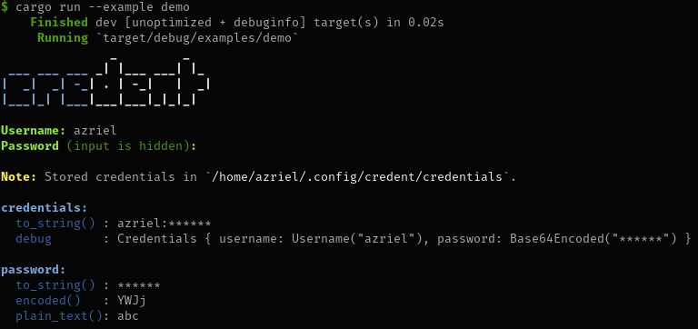

# Credent

[](https://crates.io/crates/credent)

[](https://codecov.io/gh/azriel91/credent)

Manages `~/.config/<app>/credentials`.



## Usage

```rust
use credent::{
    cli::CredentialsCliReader,
    fs::{model::AppName, CredentialsFile, CredentialsFileStorer},
    model::Credentials,
};

/// Application name
const CREDENT: AppName<'_> = AppName("credent");

fn main() -> Result<(), Box<dyn std::error::Error>> {
    smol::run(async {
        let credentials = CredentialsCliReader::<Credentials>::read_from_tty().await?;
        println!("credentials: {}", credentials);

        CredentialsFileStorer::<Credentials>::store(CREDENT, &credentials).await?;

        println!(
            "credentials written to: {}",
            CredentialsFile::<Credentials>::path(CREDENT)?.display()
        );

        Result::<(), Box<dyn std::error::Error>>::Ok(())
    })
}
```

More sample code can be seen in the [examples](examples).

```
cargo run --example simple
cargo run --example demo
cargo run --example profiles
cargo run --example profiles -- --profile development
```

## License

Licensed under either of

* Apache License, Version 2.0, ([LICENSE-APACHE](LICENSE-APACHE) or https://www.apache.org/licenses/LICENSE-2.0)
* MIT license ([LICENSE-MIT](LICENSE-MIT) or https://opensource.org/licenses/MIT)

at your option.

### Contribution

Unless you explicitly state otherwise, any contribution intentionally submitted for inclusion in the work by you, as defined in the Apache-2.0 license, shall be dual licensed as above, without any additional terms or conditions.
